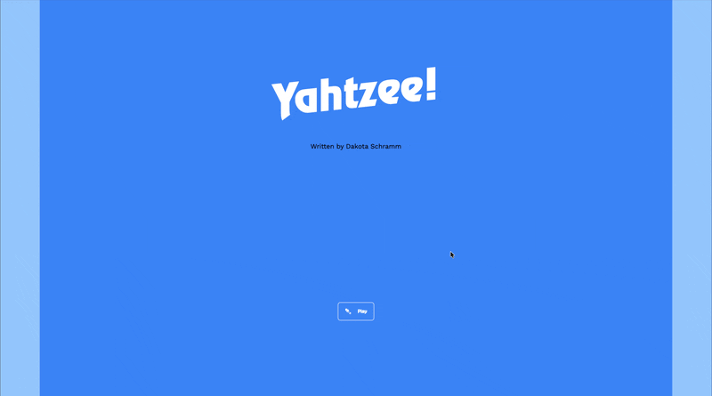

# Yahtzee!

[](https://dakotaschramm.com/next-yahtzee/)
[](https://nextjs.org/)
[](.)



A fully playable Yahtzee dice game built with Next.js — managing the entire game loop through XState finite state machines instead of ad-hoc React state.

## The Problem

Dice games seem simple, but modeling 13 rounds of rolling, holding, scoring, and bonus tracking creates a tangled web of interdependent state. Most implementations lean on sprawling `useState` chains that become difficult to reason about and debug.

## The Solution

- **Finite state machine architecture** — XState models the full game lifecycle (welcome → rolling → deciding → scoring → game over) as explicit, predictable state transitions
- **Complete Yahtzee ruleset** — All 13 scoring categories, 35-point upper section bonus, Yahtzee bonus stacking, and joker rules
- **State machine over state management** — No Redux, no Zustand, no tangled `useState` chains — XState models the full game loop as explicit, deterministic transitions

## Screenshots

<!-- TODO: Add gameplay screenshots or a demo GIF here -->
<!-- Recommended: welcome screen, mid-game with held dice, scoring selection, game over -->

## My Role

Solo-built from scratch. Designed the state machine architecture, implemented all game logic and scoring calculations, created the responsive UI with custom SVG dice, and set up the CI/CD pipeline.

- Designed and implemented an XState state machine handling 5 game states and 8+ actions
- Built 15 unit tests covering every scoring category (upper and lower sections)
- Created interactive dice UI with hold/release mechanics, sound effects, and responsive layout
- Deployed as a static site via GitHub Actions to GitHub Pages

## Quick Start

```bash
yarn install
yarn dev
```

Open [http://localhost:3000](http://localhost:3000) to play locally.

## Tech Stack

| Layer        | Technology                        |
|--------------|-----------------------------------|
| Framework    | Next.js (React 18, TypeScript)    |
| State        | XState finite state machine       |
| Styling      | Tailwind CSS                      |
| Testing      | Jest + React Testing Library      |
| E2E          | Cypress                           |
| Deployment   | GitHub Actions → GitHub Pages     |

## Connect

[](https://linkedin.com/in/dakotaschramm)
[](https://dakotaschramm.com)
